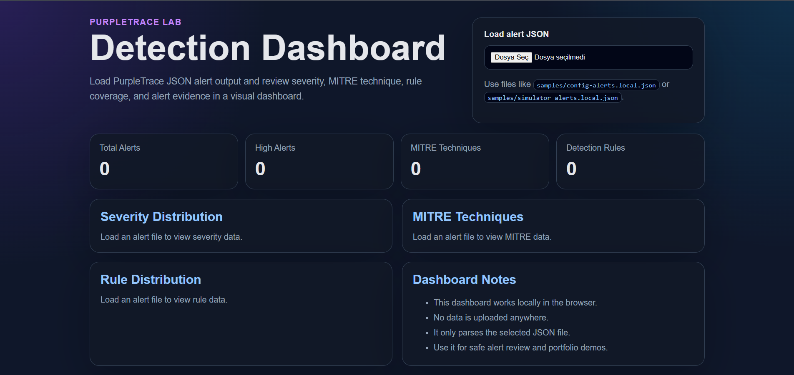
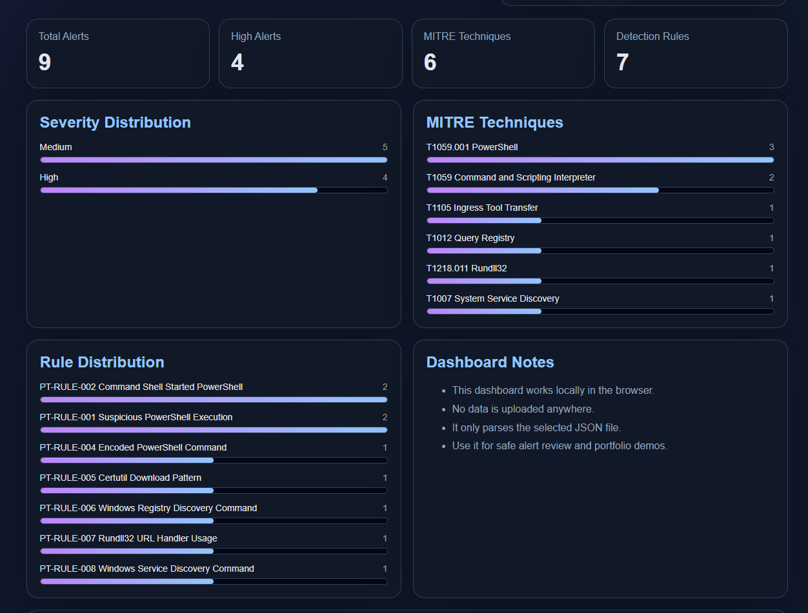
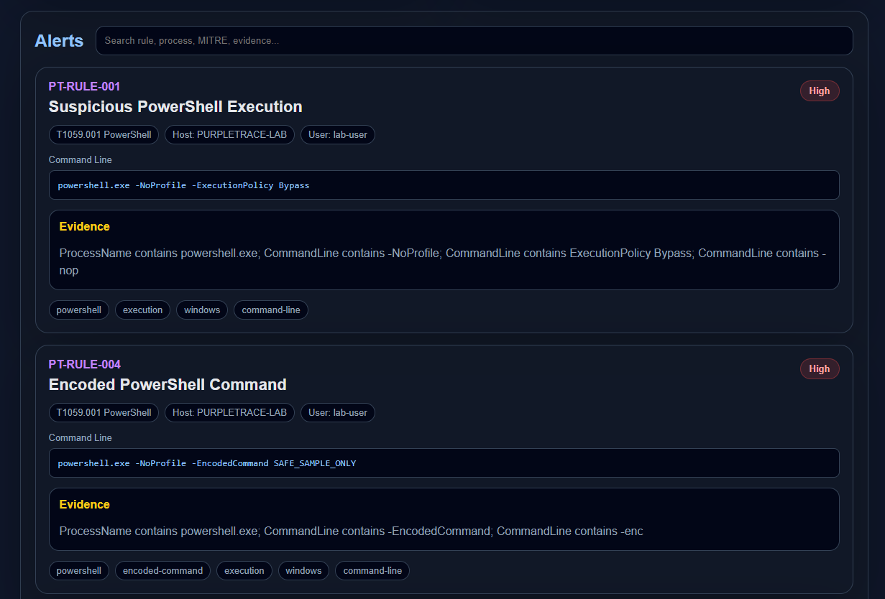
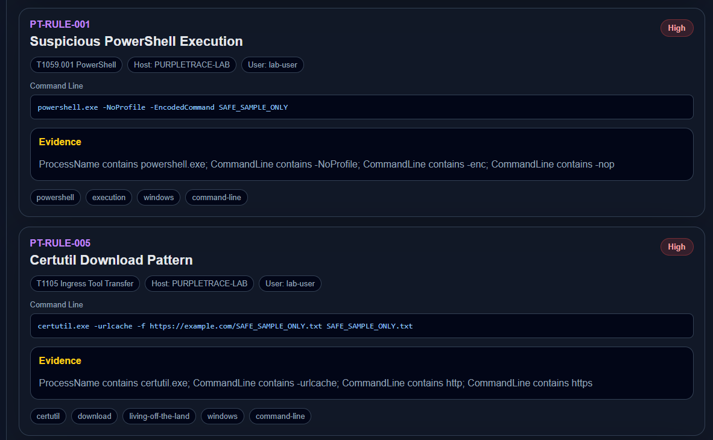
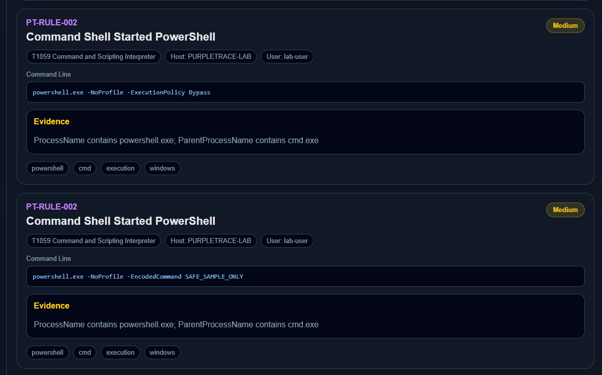
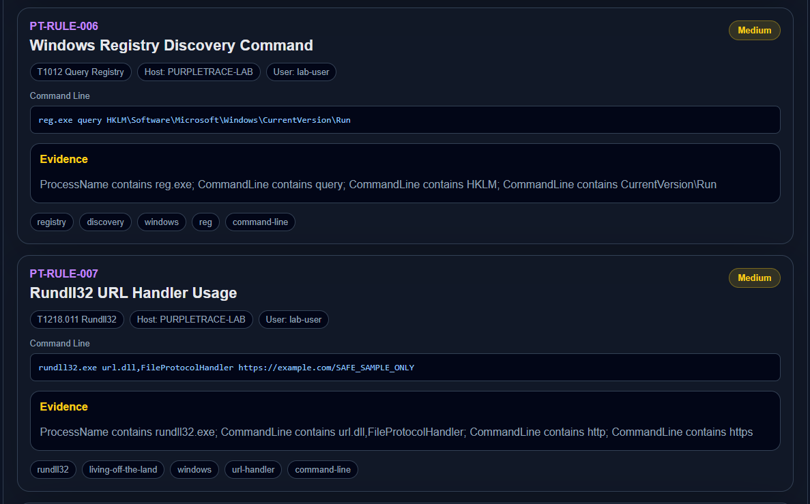
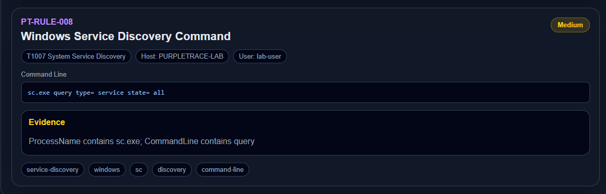

# PurpleTrace Lab

PurpleTrace Lab is a defensive Windows endpoint telemetry and detection engineering lab built for safe Purple Team learning.

The project loads endpoint-style events, applies JSON-based detection rules, enriches alerts with MITRE ATT&CK metadata, and exports the results into analyst-friendly reports, dashboards, and investigation workflows.

> This project is defensive-only. It does not contain malware, exploit code, evasion logic, shellcode, process injection, credential theft, persistence logic, or offensive payloads.

---

## PurpleTrace Lab v0.2.0

PurpleTrace Lab v0.2.0 turns the project into a more complete defensive detection engineering lab.

The project now includes:

* Safe synthetic telemetry generation
* JSON-based detection rules
* MITRE ATT&CK metadata
* JSON, Markdown, CSV, HTML, summary, and investigation report exports
* Local browser-based detection dashboard
* Professional React-based PurpleTrace Console
* Structured analyst investigation workflow
* Rule coverage documentation
* Defensive-only demo flow

Recommended demo flow:

```text
Simulator -> Agent -> Reports -> Dashboard -> Investigation Report
```

---

## Screenshots

### Dashboard Overview



PurpleTrace Dashboard is a local browser-based interface for reviewing exported alert JSON files. It runs fully locally and does not upload data anywhere.

---

### Detection Metrics and Rule Distribution



The dashboard summarizes total alerts, high severity alerts, MITRE technique coverage, detection rule count, severity distribution, MITRE technique distribution, and rule distribution.

---

### Alert Evidence View



Each alert card shows the rule ID, rule name, severity, MITRE technique, host, user, command line, evidence summary, and rule tags.

---

### High Severity Detection Examples



High severity detections include suspicious PowerShell execution, encoded PowerShell command usage, and certutil download pattern detection.

---

### Command Shell to PowerShell Detection



PurpleTrace can identify command shell activity that starts PowerShell and display the matched evidence used by the rule.

---

### Registry and Rundll32 Detection Examples



The dashboard includes detection examples for Windows registry discovery and Rundll32 URL handler usage with MITRE technique mapping and evidence summaries.

---

### Windows Service Discovery Detection



PurpleTrace includes service discovery detection coverage and displays command-line evidence, tags, severity, and MITRE mapping.

---

## PurpleTrace Console

PurpleTrace Console is a professional local browser-based security interface for PurpleTrace Lab.

It provides a modern analyst-style UI for reviewing detection alerts, MITRE ATT&CK mappings, rule coverage, report outputs, and investigation workflow.

The console includes:

* Security overview dashboard
* Alert review workspace
* Searchable alert list
* Severity, MITRE, and rule distribution charts
* Detection rule catalog
* Investigation workspace
* Reports overview
* Local JSON alert upload support
* Defensive-only safety scope page

Run the console locally:

```powershell
cd console
npm install
npm run dev
```

Build the console:

```powershell
cd console
npm install
npm run build
cd ..
```

PurpleTrace Console is designed as a local security product-style interface. It does not upload alert data anywhere.

---

## What This Project Demonstrates

PurpleTrace Lab demonstrates practical skills in:

* Windows endpoint telemetry concepts
* Detection engineering
* JSON-based rule design
* MITRE ATT&CK mapping
* Alert enrichment
* CLI tool development
* Report generation
* Investigation workflow design
* React-based security UI development
* Unit testing
* GitHub Actions CI
* Safe Purple Team learning

---

## Features

PurpleTrace Lab currently supports:

* Loading sample endpoint telemetry from JSON files
* Loading batch endpoint telemetry from JSON arrays
* Loading JSONL / NDJSON event files
* Reading Sysmon process creation events on Windows
* Loading JSON-based detection rules
* Rule validation
* Rule catalog listing
* Rule coverage export
* Severity filtering
* MITRE technique filtering
* Rule ID filtering
* Rule tag filtering
* Alert evidence enrichment
* JSON alert export
* Markdown report export
* CSV alert export
* HTML report export
* JSON run summary export
* Markdown investigation report export
* Safe synthetic telemetry simulation
* Local browser-based dashboard
* Professional PurpleTrace Console UI
* Structured investigation workflow
* Unit tests with xUnit
* GitHub Actions build workflow

---

## Current Detection Coverage

PurpleTrace Lab currently includes detection coverage for:

* Suspicious PowerShell execution
* Command shell started PowerShell
* Windows discovery commands
* Encoded PowerShell command
* Certutil download pattern
* Registry discovery command
* Rundll32 URL handler usage
* Windows service discovery command

---

## Project Structure

```text
PurpleTrace-Lab/
├── config/
│   └── purpletrace.sample.json
├── console/
│   └── React-based PurpleTrace Console UI
├── dashboard/
│   └── Local HTML/CSS/JS detection dashboard
├── docs/
│   ├── assets/
│   ├── demo-guide.md
│   ├── investigation-workflow.md
│   ├── project-overview.md
│   ├── rule-coverage.md
│   ├── simulator.md
│   └── v0.2.0-release-notes.md
├── rules/
│   └── JSON detection rules
├── samples/
│   └── Safe sample telemetry and local output examples
├── src/
│   ├── PurpleTrace.Agent/
│   └── PurpleTrace.Simulator/
├── templates/
│   └── investigation-case-template.md
├── tests/
│   └── PurpleTrace.Agent.Tests/
└── README.md
```

---

## How It Works

PurpleTrace Agent follows a simple detection pipeline:

```text
Endpoint Events
      ↓
Event Loader / Sysmon Collector
      ↓
Detection Rules
      ↓
Detection Engine
      ↓
Alert Enrichment
      ↓
Filters
      ↓
Reports and Exports
```

The detection engine compares endpoint event fields such as process name, command line, and parent process name against rule conditions.

When a rule matches, the generated alert includes:

* Rule information
* Severity
* MITRE tactic and technique
* Host and process details
* Evidence summary
* Matched fields
* Matched values
* Rule metadata
* Source event reference

---

## Requirements

* Windows
* .NET SDK
* Node.js and npm for PurpleTrace Console
* Optional: Sysmon for real Windows event log collection

Check your .NET installation:

```powershell
dotnet --version
```

Check your Node.js installation:

```powershell
node --version
npm --version
```

---

## Build and Test

Build and test the .NET solution:

```powershell
dotnet build
dotnet test
```

Build PurpleTrace Console:

```powershell
cd console
npm install
npm run build
cd ..
```

---

## Basic Usage

Run with the sample config:

```powershell
dotnet run --project src\PurpleTrace.Agent -- --config config\purpletrace.sample.json
```

Expected result:

```text
Detected alerts before filtering: 3
Exported alerts: 3
```

---

## Synthetic Telemetry Simulator

PurpleTrace Lab includes a safe synthetic telemetry simulator.

The simulator writes JSON or JSONL endpoint-style events without executing commands or performing system changes.

Generate simulated telemetry:

```powershell
dotnet run --project src\PurpleTrace.Simulator -- --scenario all --format jsonl --out samples\simulated-events.local.jsonl
```

Analyze simulated telemetry:

```powershell
dotnet run --project src\PurpleTrace.Agent -- --source sample --rules rules --event samples\simulated-events.local.jsonl --out samples\simulator-alerts.local.json --report samples\simulator-report.local.md --csv samples\simulator-alerts.local.csv --html samples\simulator-report.local.html --summary samples\simulator-summary.local.json --investigation samples\simulator-investigation.local.md
```

More details:

```text
docs/simulator.md
```

---

## Local Detection Dashboard

PurpleTrace Lab includes a local browser dashboard for reviewing exported alert JSON files.

Open the dashboard:

```powershell
start dashboard\index.html
```

Then load an alert file such as:

```text
samples\simulator-alerts.local.json
```

The dashboard displays:

* Total alerts
* High alerts
* MITRE technique count
* Detection rule count
* Severity distribution
* MITRE technique distribution
* Rule distribution
* Searchable alert cards
* Command-line evidence
* Evidence summaries
* Rule tags

The dashboard runs locally in the browser and does not upload data anywhere.

---

## PurpleTrace Console Usage

PurpleTrace Console is the modern application-style interface for the project.

Run it locally:

```powershell
cd console
npm install
npm run dev
```

Then open the URL shown in the terminal, usually:

```text
http://localhost:5173
```

Build it for production:

```powershell
cd console
npm run build
cd ..
```

---

## List Rules

```powershell
dotnet run --project src\PurpleTrace.Agent -- --list-rules --rules rules
```

---

## Validate Rules

```powershell
dotnet run --project src\PurpleTrace.Agent -- --validate-rules --rules rules
```

---

## Export Rule Coverage

```powershell
dotnet run --project src\PurpleTrace.Agent -- --export-rule-coverage docs\rule-coverage.md --rules rules
```

---

## Run with JSONL Events

```powershell
dotnet run --project src\PurpleTrace.Agent -- --source sample --rules rules --event samples\sample-event-batch.jsonl --out samples\jsonl-alerts.local.json --report samples\jsonl-report.local.md --csv samples\jsonl-alerts.local.csv --html samples\jsonl-report.local.html --summary samples\jsonl-summary.local.json --investigation samples\jsonl-investigation.local.md
```

---

## Filters

Minimum severity filter:

```powershell
dotnet run --project src\PurpleTrace.Agent -- --config config\purpletrace.sample.json --min-severity High
```

MITRE technique filter:

```powershell
dotnet run --project src\PurpleTrace.Agent -- --config config\purpletrace.sample.json --mitre-technique T1082
```

Rule ID filter:

```powershell
dotnet run --project src\PurpleTrace.Agent -- --config config\purpletrace.sample.json --rule-id PT-RULE-003
```

Rule tag filter:

```powershell
dotnet run --project src\PurpleTrace.Agent -- --config config\purpletrace.sample.json --tag discovery
```

---

## Output Files

The sample config generates local output files under `samples/`:

```text
samples/config-alerts.local.json
samples/config-report.local.md
samples/config-alerts.local.csv
samples/config-report.local.html
samples/config-summary.local.json
samples/investigation-report.local.md
```

These local generated files are intended for testing and are ignored by Git.

---

## Detection Rules

Rules are stored as JSON files in the `rules/` directory.

Each rule can include:

* Rule ID
* Title
* Description
* Severity
* MITRE tactic
* MITRE technique ID
* MITRE technique name
* Author
* Creation date
* Tags
* References
* Process matching conditions
* Command line matching conditions
* Parent process matching conditions

Example rule intent:

```text
Detect suspicious PowerShell execution patterns from endpoint process creation telemetry.
```

---

## Reports

PurpleTrace Lab can generate multiple output formats:

| Format                 | Purpose                                             |
| ---------------------- | --------------------------------------------------- |
| JSON                   | Machine-readable alert output                       |
| Markdown               | Analyst-readable report                             |
| CSV                    | Spreadsheet-friendly alert export                   |
| HTML                   | Visual report for review and portfolio presentation |
| Summary JSON           | Machine-readable run summary                        |
| Investigation Markdown | Analyst-style investigation report                  |

---

## Investigation Workflow

PurpleTrace Lab includes a structured investigation workflow for reviewing detection alerts.

The workflow helps move from raw alert output to analyst-style review by documenting:

* Alert details
* Rule context
* MITRE ATT&CK mapping
* Process evidence
* Matched fields and matched values
* Source event review
* Analyst questions
* Recommended next steps
* Final decision

Investigation workflow documentation:

```text
docs/investigation-workflow.md
```

Reusable case template:

```text
templates/investigation-case-template.md
```

Sample investigation case:

```text
samples/sample-investigation-case.md
```

This component is designed for defensive alert review and portfolio demonstration.

---

## Demo Guide

The recommended demo guide is available here:

```text
docs/demo-guide.md
```

Recommended demo flow:

```text
Simulator -> Agent -> Reports -> Dashboard -> Investigation Report
```

---

## Release Notes

v0.2.0 release notes are available here:

```text
docs/v0.2.0-release-notes.md
```

---

## Safety Scope

This project is designed for defensive security education and portfolio demonstration.

It does not perform or include:

* Exploitation
* Persistence
* Privilege escalation
* Credential theft
* Evasion
* Malware execution
* Process injection
* Shellcode
* Destructive behavior
* Unauthorized activity

The included sample events are static telemetry examples used to test detection logic safely.

---

## Documentation

Additional documentation:

* [Project Overview](docs/project-overview.md)
* [Demo Guide](docs/demo-guide.md)
* [PurpleTrace Simulator](docs/simulator.md)
* [Investigation Workflow](docs/investigation-workflow.md)
* [Rule Coverage](docs/rule-coverage.md)
* [How to Explain This Project](docs/how-to-explain.md)
* [Safety Scope](docs/safety.md)
* [Roadmap](docs/roadmap.md)
* [v0.2.0 Release Notes](docs/v0.2.0-release-notes.md)

---

## Current Status

PurpleTrace Lab is currently a portfolio-ready defensive detection engineering lab.

The project includes:

* Detection Agent
* Synthetic Telemetry Simulator
* Local Detection Dashboard
* PurpleTrace Console
* Rule Coverage Documentation
* Investigation Workflow
* Investigation Markdown Exporter
* Multi-format report outputs
* MITRE ATT&CK metadata support
* Safe demo flow for portfolio presentation

Future improvements can focus on packaging, additional safe detections, richer UI workflows, and optional desktop packaging with Tauri.
